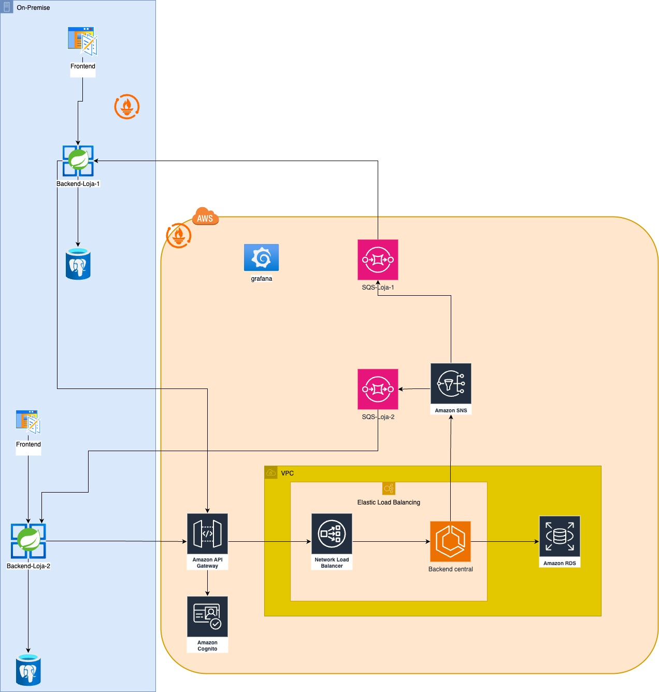
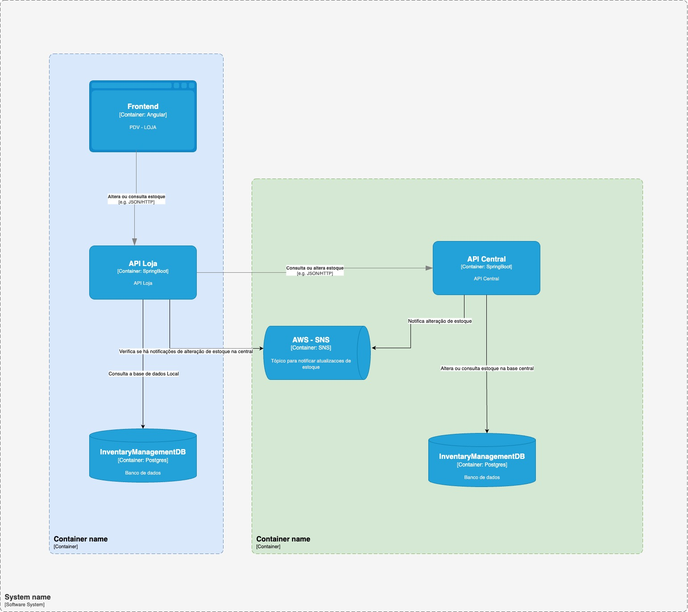
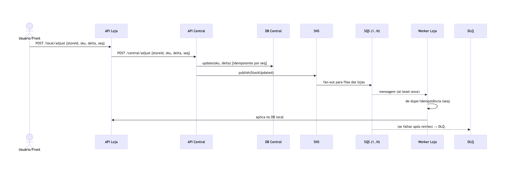

# 📦 Inventory Management System – Distributed Prototype

## 🎯 Objetivo

Este projeto implementa um **protótipo de melhoria** no sistema de gerenciamento de inventário, resolvendo os problemas de **sincronização de dados, latência e consistência** entre lojas físicas e sistema central.

O foco foi criar uma arquitetura distribuída, desacoplada e resiliente, aplicando **boas práticas de arquitetura hexagonal**, mensageria e fallback para cenários de falha.

---


---

## 🏗️ Arquitetura da Solução

A solução foi dividida em **dois serviços principais**:

### 1. API de Inventário da Loja

* **Tecnologia:** Spring Boot (Java 21) + H2 Database (somente para simplificação do desafio).
* **Responsabilidades:**

  * Receber solicitações do **front-end** para alteração ou consulta de inventário.
  * Alteração de estoque → **POST para API Central**.
  * Consulta de estoque → consulta **diretamente a API Central**.

    * Se a API Central não estiver disponível, consulta o **banco local (fallback)**.
* **Arquitetura:** Hexagonal (Ports & Adapters).

---

### 2. API Central

* **Tecnologia:** Spring Boot (Java 21) + H2 Database (somente para simplificação do desafio).
* **Responsabilidades:**

  * Processar alterações recebidas das lojas.
  * Atualizar o **banco de dados central**.
  * Publicar evento no **SNS (Amazon Simple Notification Service)**.
  * Distribuir atualizações para todas as lojas via **SQS** (cada loja possui sua fila, garantindo retry e resiliência em caso de falha de comunicação).

---

---


---

### 🔄 Fluxo de Operações

1. **Alteração de Estoque**

   * Loja recebe solicitação do front → POST para API Central.
   * API Central atualiza banco central → Publica evento no **SNS**.
   * SNS → Entrega em todas as filas **SQS** das lojas.
   * Lojas recebem atualização e sincronizam seus bancos locais.

2. **Consulta de Estoque**

   * Loja → API Central → Banco de Dados Central → Retorno para front.
   * Caso API Central indisponível → consulta ao **banco local**.

---

## 🧭 Diagramas

### Arquitetura Geral



---

## ✅ Justificativas Técnicas

### Java 21 (LTS)

* **Ampla adoção e talento no mercado:** Java segue entre os ecossistemas mais utilizados, facilitando contratação e manutenção.
* **LTS estável:** a versão 21 é **Long-Term Support**, ideal para produção e ciclos longos.
* **Performance e produtividade:**

👉 Em resumo: **baixo custo de manutenção, alta performance e produtividade com código moderno**.

---

### Spring Boot (3.x)

* **Padrão de mercado no ecossistema Java** para microsserviços.
* **Produtividade:** starters, autoconfiguração, actuator (health, métricas).
* **Resiliência & integração:**

  * Circuit breaker/retry (**Resilience4j / Spring Retry**).
  * **Spring Web** para REST, **Spring Data JPA** para persistência.
  * Integração simples com **SQS/SNS** (Spring Cloud AWS / SDK).
* **Testabilidade:** suporte a test slices, testcontainers, perfis de ambiente.

👉 Em resumo: **reduz boilerplate, acelera entrega e padroniza boas práticas**.

---

### SNS + SQS vs. Kafka

* **Cenário conservador (10 lojas, tps moderado):**

  * **SNS + SQS**: simples, baixo custo, fan-out nativo, zero administração, retry por fila/loja.
  * **Kafka**: indicado para cenários de **alto throughput, ordering, reprocessamento massivo ou retenção longa** — o que não foi especificado no desafio.
* **Trade-off:** aceitamos **at-least-once delivery** (garantido via `seq` idempotente) em vez de exactly-once.

👉 Em resumo: **SNS + SQS garante simplicidade operacional, resiliência e custo inferior** para este caso.

---

### AWS Cognito

* **Gerenciado (SaaS):** elimina necessidade de IdP customizado.
* **Padrões abertos:** OAuth2, OIDC, JWT → integração direta com **Spring Security**.
* **Funcionalidades prontas:** MFA, políticas de senha, federation social/enterprise.
* **Custo sob demanda:** menor TCO.

👉 Em resumo: **rápido de integrar, seguro por padrão e com baixo custo de manutenção**.

---

### Arquitetura Hexagonal

* **Separação clara** entre domínio, aplicação e infraestrutura.
* **Domínio independente de frameworks** → maior testabilidade e evolução tecnológica.
* **Adapters especializados** (REST, DB, SQS) → isolamento de integrações externas.

👉 Em resumo: **flexibilidade, clareza e manutenibilidade**.

---

## ▶️ Execução com Maven

De permissao para execução do 10-init-sns-sqs.sh, ele vai configurar o sns e filas no localstack

```
chmod +x localstack/init/10-init-sns-sqs.sh

```

O projeto está dockerizado, por padrao será iniciada 10 lojas e uma api central

```docker compose up -d
```


### Doc das API

* (Loja) http://localhost:8082/swagger-ui/index.html
* (Central) http://localhost:8081/swagger-ui/index.html

* `POST /local/adjust` → Alteração de inventário.
* `GET /inventory/{sku}` → Consulta de inventário.

---

## 📈 Próximos Passos

### Observabilidade

* **Prometheus + AMG**: métricas, alertas e dashboards.
* **Tracing distribuído**: OpenTelemetry para spans cross-service.
* **DLQ monitoring**: acompanhamento de falhas definitivas.

### Segurança

* **Cognito integrado ao Spring Security**.
* **RBAC por roles/claims**.
* **MFA e boas práticas de gestão de credenciais**.

---

## 📌 Conclusão

Esta solução:

* Resolve os problemas do **sistema monolítico** anterior.
* Garante **sincronização near real-time** entre lojas.
* Suporta **tolerância a falhas** com mensageria + fallback local.
* Está **pronta para evolução** com observabilidade e segurança em ambiente AWS.

---

## Observações: 
A observabilidade não foi implementada devido ao tempo para a implementação da solução porém foi adicionada no desenho infra, soluções de observabildade com Prometheus e AWS AMG (Grafana) para coleta de metricas dash, logs com Cloudwatch ou loki 

